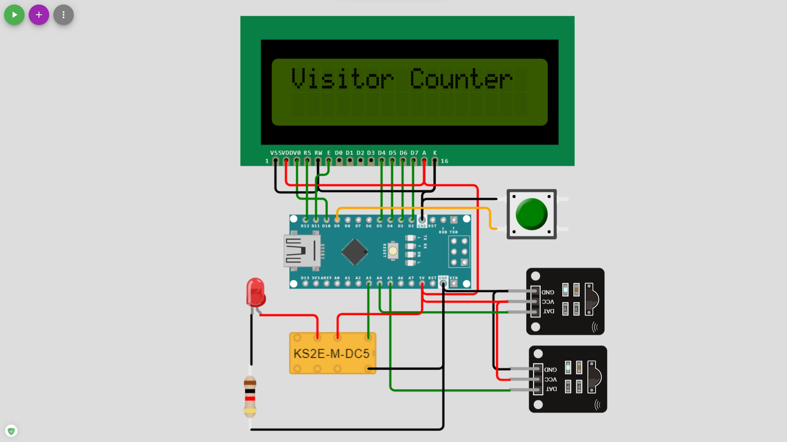

# Person Counter & Room Automation 

### The Idea
In our college and my previous school every day after lunch the peon used to visit every class and count the number of students inside the class for the school records. So looking at this my friend came up with a thought to make a device for the same. In the same semester, we got or mini-project based on IoT. So we thought it was a good time to build it. \
\
At first, we thought of using a face detection model and deploying it to Arduino, so that it could count the number of people and as well as take the attendance of the students. But..... there were two problems with that. None of us knew TinyML so after building the model we might have to spend time learning TinyML another is that the face detection model counts an image too, so anyone could have fooled the system by just showing the picture of a person.  So I decided to use the IR sensor module. But after our whole project was built then I got to know that there were two types of IR, near and far, and I had the near one so its range was not more than around 5cm. I searched for the far IR module in the offline market but it wasn’t available. So for demonstration purposes, I went with the near IR. Laser and Photo sensors could also have been used but we dint went for that. 

### Requirements
- Arduino Nano
- 16x2 LCD
- 2 Long Range IR Sensors And Emittors or 2 Light Sensors and Lasers.
- Push Button
- Relay Module

### Connection
Due to resource limitations on the online simulator, the single-channel relay has been replaced with a DPDT relay but connections will be likely the same. \

 

### Working
- The model consists of two Individual IR sensor modules both will be installed in the door one will be inside the room and another will be outside of the room but the distance between them is not too much, around 15 cm should do the work. When a person is entering the room it will first trigger the outer sensor and then until he crosses the inner sensor he won't be counted as inside the room and vice-versa.
- The last count is stored in the memory of the Arduino. To reset it a push-button has been installed which on holding for about 2 seconds will reset the count to zero. 
- The single-channel relay is used to automate the room lighting. When the first person enters the room the lights will light up and when the last person leaves the room the lights will go down.

### Working Video
https://user-images.githubusercontent.com/70506573/177790293-78b02812-db78-4a24-8622-21c4a4987612.mp4

### Possible Upgrades/Changes
- The IR module can be replaced with the laser and photosensor to make a grid-like structure with the help of small mirrors.
- 3 sensors can be used instead of 2 to make it more precise, changes to the code have to be done accordingly.
- Multiple relays can be used for multiple automation purposes as per person count. 
